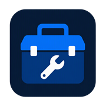
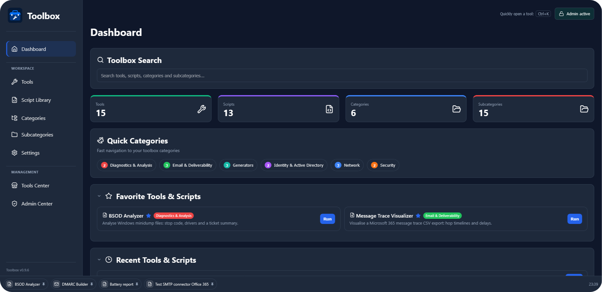
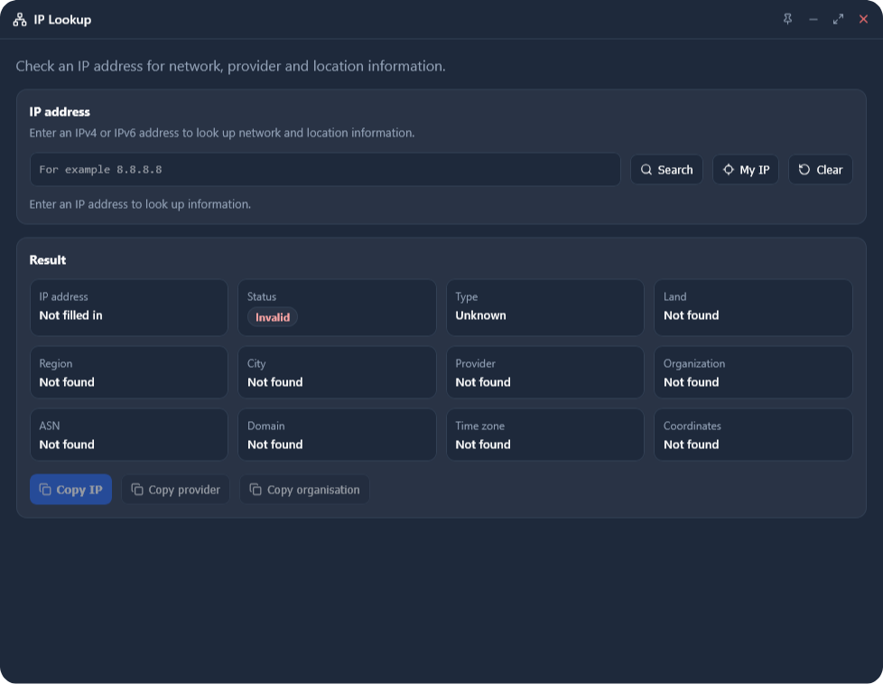

# Toolbox

As someone working in IT support and Microsoft 365 administration, I wanted a single platform that brings together the tools I use most often. What began as a small collection of utilities quickly grew into a modern, self-hosted toolbox designed for service desks, system administrators, MSPs, and other IT professionals.

The goal with this project is to create something that is genuinely useful: a platform that saves time, reduces complexity, and gives full control over their data without relying on dozens of separate services.

I hope Toolbox can make your daily IT work just a little bit easier.

## Features

- **Tool catalog** — network, mail, security, certificate, identity, and data-encoding tools (DNS lookups, SPF/DMARC/DKIM builders, SSL/certificate inspection, password & secret generation, BSOD/message-trace/sign-in-anomaly analyzers, and more), organized by category and subcategory.
- **Script Library** — store, tag, and reuse PowerShell/other scripts with templated input fields, favorites, and admin-only visibility.
- **Tools Center** — browse, enable/disable, and feature tools from a catalog view.
- **Admin Center** — organization-wide settings in one place: general defaults (language/timezone/theme/clock), authentication (shared password, local users, Microsoft Entra ID, or hybrid), branding (app name/logo/colors/login page), automatic + manual backups with restore, activity logging with retention policies, and system info.
- **First Startup Wizard** — guided setup on a fresh install: create a new instance or restore from a backup, then set org-wide language/timezone/theme defaults.
- **Multi-language** — English, Dutch, Frisian, and Turkish, with an org-wide default and a per-browser override.
- **Multi-window workspace** — open several tools and scripts at once in draggable, resizable floating windows with a taskbar, or fullscreen on mobile.

## Screenshots

### Dashboard

### Tool Example

## Installation

The recommended way to run Toolbox is via Docker and Portainer. See:

[Docker instructions](docker/docker-readme.md)

## Work in Progress
Toolbox is a personal project developed and maintained in my spare time. While the application is actively used and continuously improved, it is still a work in progress. Not all features are fully implemented, bugs may occur, and documentation may occasionally lag behind the latest changes.

## AI Disclaimer

The tool is completely Built by Claude Code

## License

MIT License

See the [LICENSE](LICENSE) file for details.
